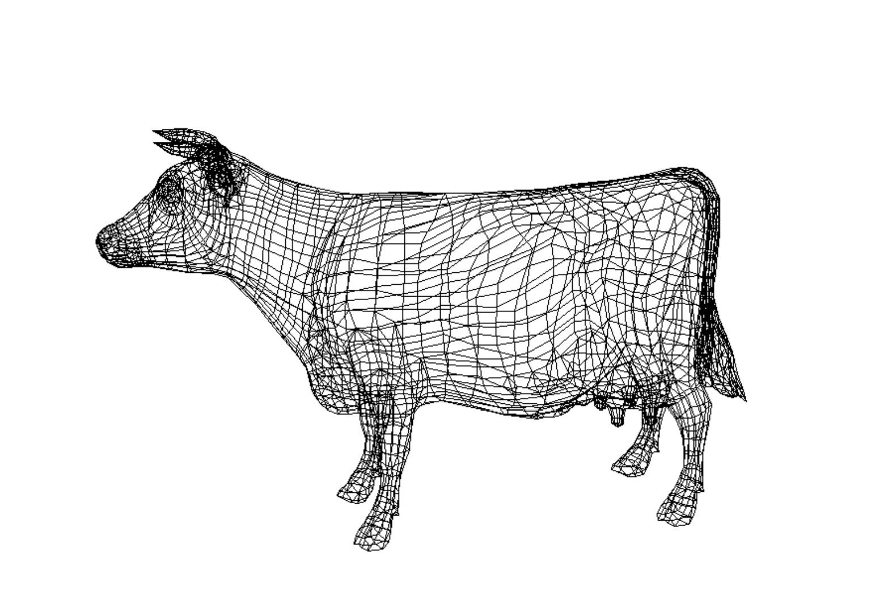
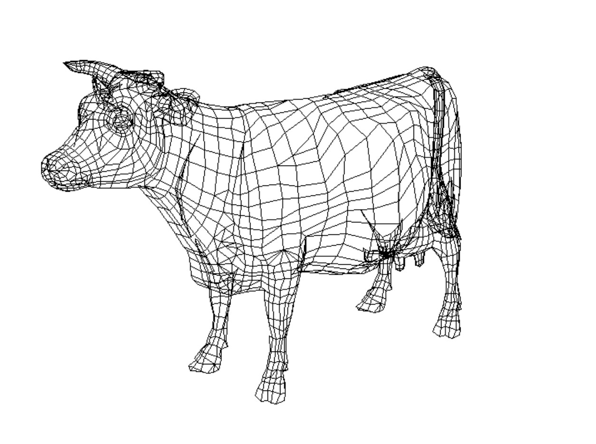
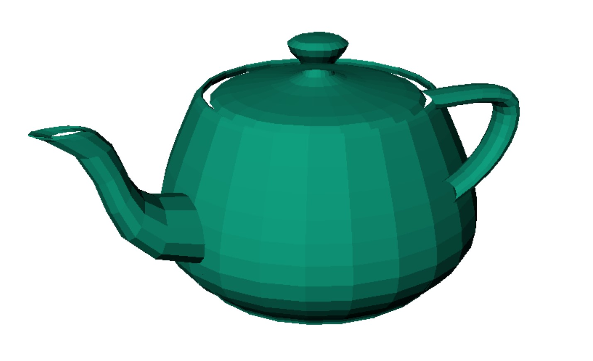
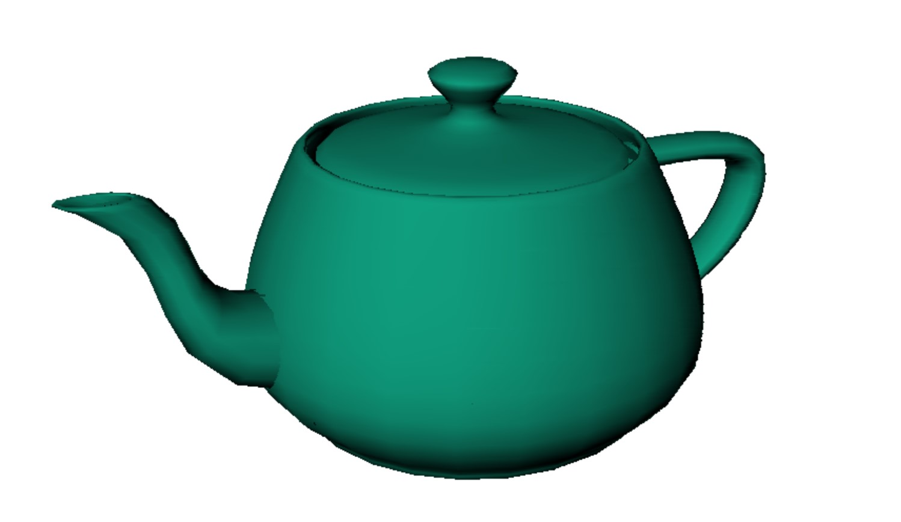
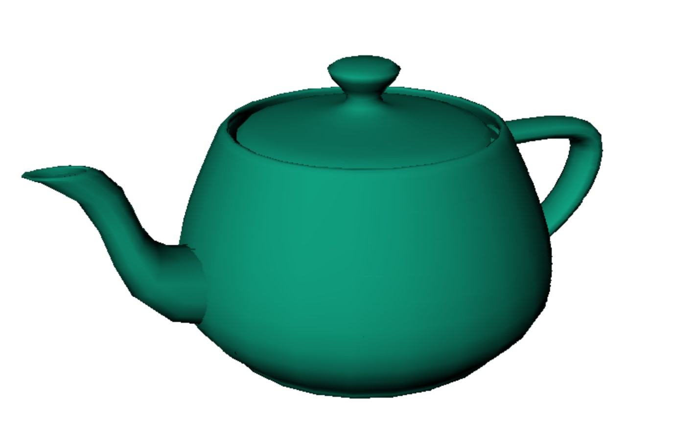
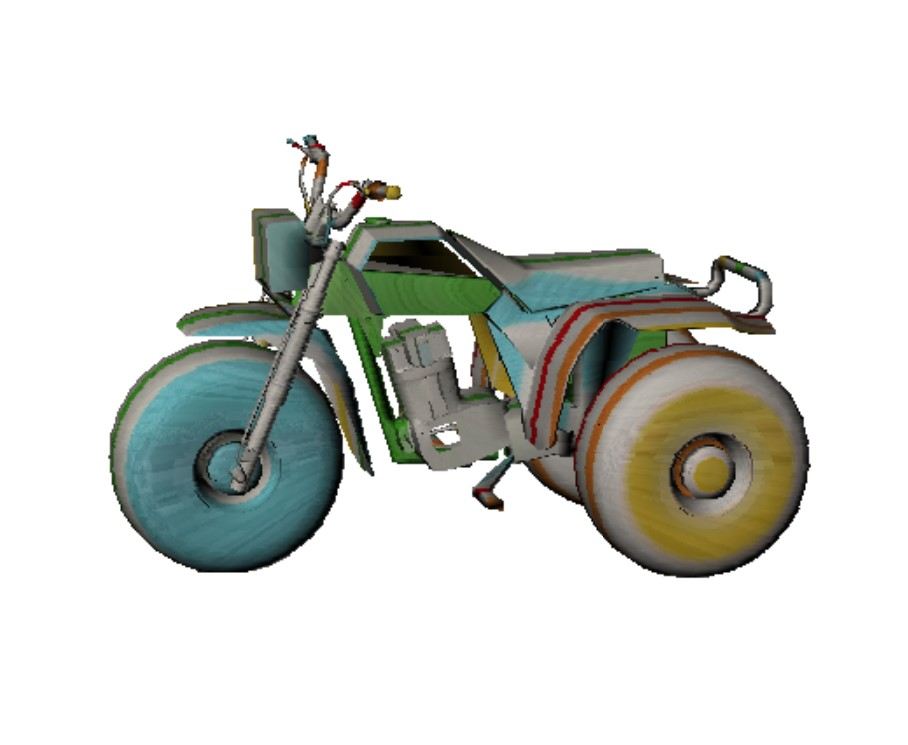
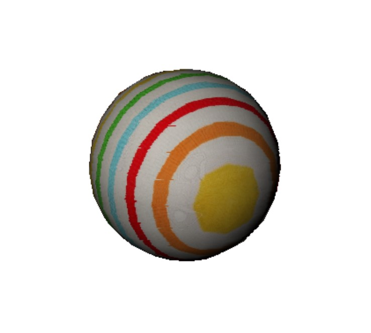

#   Rendering System for 3D object   |   

##  Modules

|   Files               |   Description     |
| ---------------       |   --------------- |
|   Camera              | Defines camera parements, Viewing and Perspective translation here.   |
|   Entrance            | Loads file, camera configuration, object initializtion, light source setting, loading texture file, choosing shading models.    |
|   Interpolation       | Scan conversion and Z-buffer functions for z values(visible surface), vertex normals(phong shading) and light intensities(ground shading), [u,v] values(texture mapping) on points.   |
|   Maxtrix Caculation  | Vectors crossproduct and dotproduct, adding and subtracting calculation, matrix multiplation, vector normalization.   |
|   Readfile            | Gets points and polygons from loaded file.
|   Rendering           | Uses thinker API to render by pixels, rgb transformation function.
|   SingleObject        | Includes object color, [u,v] for texture, points(world, screen, device) and edges, vertex normals and polygon normals, backfaceculling function.
|   Shading             | Three shading models, illumination function for single vector.
|   Texture             | Cylinder mapping to get [u,v] for single object, textureimage function to genertate texture image by using perlin noise 

##  Sample Images
### WireFrame without backface culling

### WireFrame with backface culling 

### Constant Shading

### Ground Shading

### Phong Shading

### Textures

